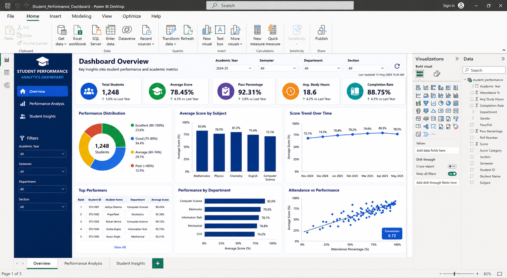
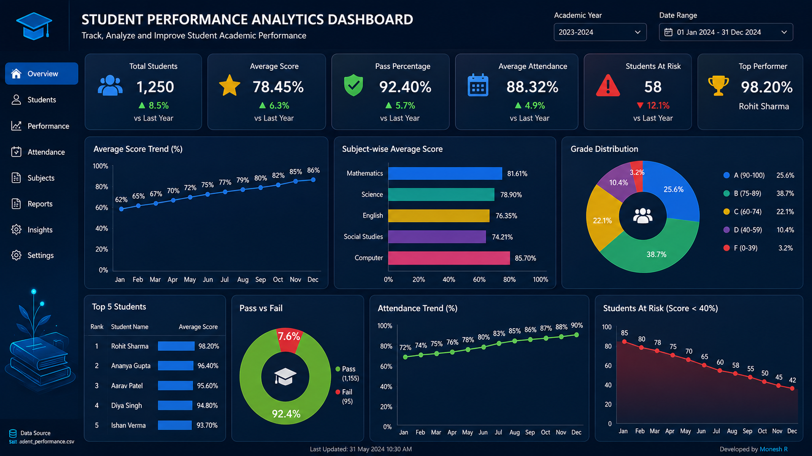
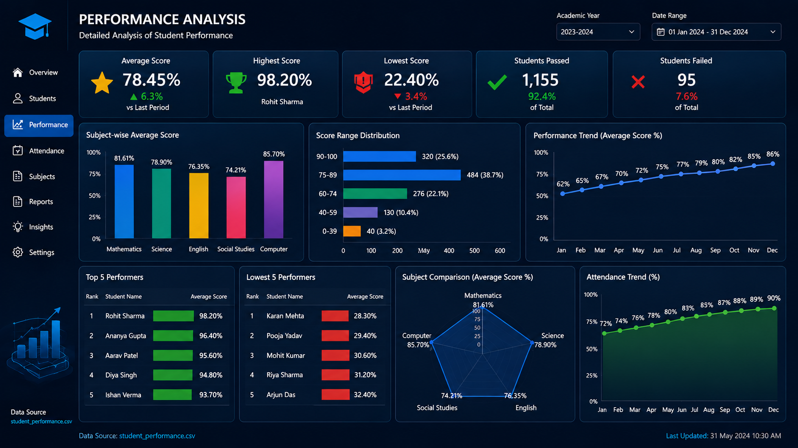
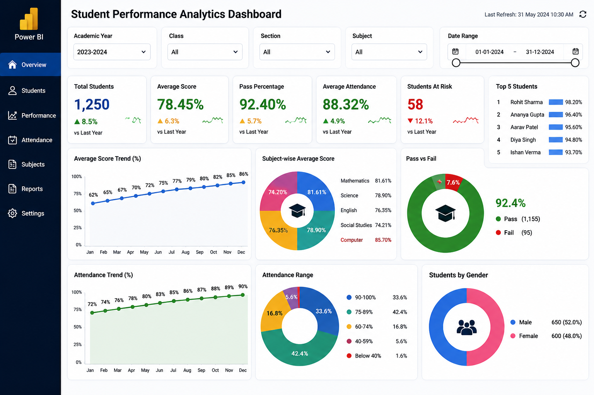
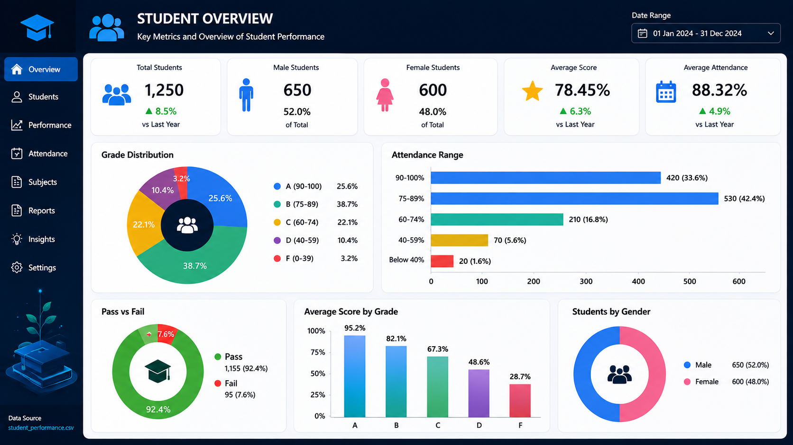

# 📊 Student Performance Analytics Dashboard

A business intelligence and data analytics project designed to analyze student academic performance, identify performance patterns, and present actionable insights through an interactive Power BI dashboard.

The project demonstrates practical capabilities in **data analysis, KPI development, dashboard design, performance monitoring, and business intelligence reporting** within an educational analytics context.

---

## 🎯 Project Overview

Educational institutions generate large volumes of student performance data that can be difficult to interpret through raw datasets alone.

This project transforms structured student performance data into an interactive analytics dashboard that enables users to monitor key academic indicators, compare performance across categories, and identify trends that can support data-driven decision-making.

The dashboard is designed as a portfolio project to demonstrate practical **Power BI and Business Intelligence capabilities**.

---

## 📈 Dashboard Highlights

The dashboard focuses on key academic performance indicators, including:

- Total Student Count
- Average Score
- Pass Percentage
- Average Study Hours
- Completion Rate
- Performance Distribution
- Subject-wise Performance
- Performance Trends
- Department-wise Performance
- Attendance vs. Performance
- Top Performing Students

---

## 🔍 Key Analytics

### Student Performance Analysis

Analyze student scores and performance categories to understand overall academic outcomes.

### Subject-wise Analysis

Compare average performance across different subjects to identify stronger and weaker academic areas.

### Department-wise Analysis

Evaluate performance across departments and identify variations in academic outcomes.

### Performance Trends

Track changes in student performance over time to identify improvement or decline patterns.

### Attendance & Performance

Analyze the relationship between attendance and academic performance.

### Top Performers

Identify high-performing students based on academic performance metrics.

---

## 🎛️ Dashboard Interactivity

The dashboard supports interactive filtering and exploration through controls such as:

- Academic Year
- Semester
- Department
- Section

These filters allow users to dynamically explore different segments of the student population.

---

## 🖥️ Dashboard Preview

### Power BI Dashboard Overview



### Dashboard Screenshots









---

## 📄 Dashboard Report

A PDF version of the dashboard/report is included for convenient review.

**Location:**

```text
dashboard/Student_Performance_Dashboard.pdf
